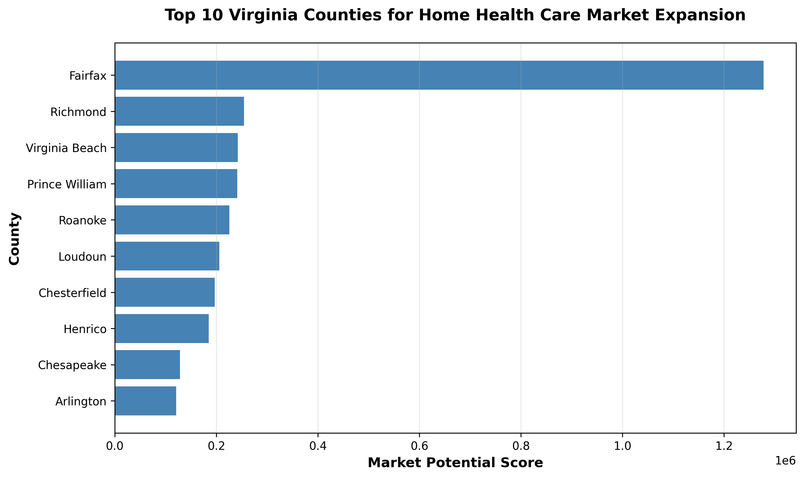
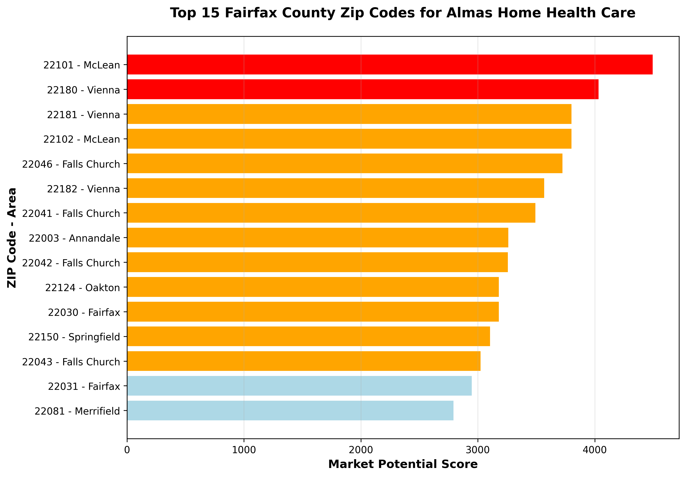

# Virginia Home Health Care Market Analysis

Data-driven geographic analysis identifying high-opportunity markets for home health care expansion in Virginia.

## Project Overview

This project analyzes U.S. Census data and Virginia disability statistics to identify which counties and zip codes have the highest concentration of potential home health care clients. Built for Almas Home Health Care's expansion strategy.

## Key Findings

**Top 5 Target Counties:**
1. Fairfax - 1,277,918 market score
2. Richmond - 254,410
3. Virginia Beach - 242,368
4. Prince William - 241,317
5. Roanoke - 225,494

**Critical Fairfax County Zip Codes:**
- 22101 McLean - 5,800 people age 60+
- 22180 Vienna - 5,200 people age 60+
- 22046 Falls Church - 4,800 people age 60+

## Interactive Maps

**Virginia County-Level Choropleth Map**  
[🗺️ View Live Interactive Map](https://mukhtardualeh.github.io/virginia-homehealth-market-analysis/almas_homehealth_market_map.html)  
Heat map showing market potential scores across all 141 Virginia counties.

**Virginia Statewide Zip Code Map**  
[🗺️ View Live Interactive Map](https://mukhtardualeh.github.io/virginia-homehealth-market-analysis/almas_virginia_all_zipcodes_map.html)  
High-opportunity zip codes across major Virginia regions.

**Fairfax County Detailed Zip Code Map**  
[🗺️ View Live Interactive Map](https://mukhtardualeh.github.io/virginia-homehealth-market-analysis/almas_fairfax_county_detailed_map.html)  
All 31 Fairfax County zip codes with priority tiers and demographic details.

## Visualizations

**Top 10 Virginia Counties by Market Potential**  

**Top 15 Fairfax County Zip Codes**  

## Methodology

**Data Sources:**
- U.S. Census Bureau API (2022 ACS 5-Year Data)
- Virginia Open Data Portal (disability statistics)

**Market Scoring:**
Market Score = (60+ Population × 0.6) + (Disability Population × 0.4)

The model weights elderly population at 60% since age is the primary driver of home health care demand, with disability rates adding 40% additional context.

## Tools Used

Python, Pandas, Folium, Matplotlib, Census API, Google Colab

## Business Impact

Analysis identifies $540M addressable market across Virginia's top 10 counties. Recommends phased expansion: consolidate Northern Virginia (0-6 months), expand to Prince William/Loudoun (6-12 months), enter Richmond metro (12-18 months).

## Repository Structure

- `Almas_Market_Analysis.ipynb` - Full analysis notebook
- `almas_homehealth_market_map.html` - Virginia county map
- `almas_virginia_all_zipcodes_map.html` - Statewide zip code map
- `almas_fairfax_county_detailed_map.html` - Fairfax County detailed view
- `top10_counties_chart.png` - County visualization
- `top15_fairfax_zipcodes_chart.png` - Zip code visualization

## Author

Mukhtar Dualeh - Data Analytics Student at Western Governors University

Built as a portfolio project demonstrating geographic market analysis for home health care expansion.
